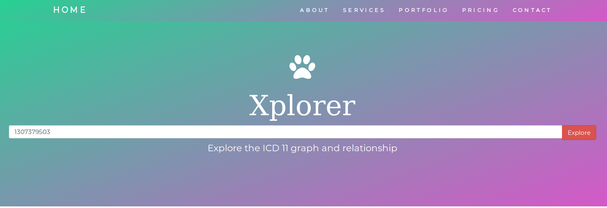

<h1 align="center">
  Xplorer 1.0
</h1>
<p align="center">
  <i> Speedy, optimized <strong>ICD 11</strong> code search!</i>
</p>

--------------------------------

<p align="center">
  <a href="https://github.com/timhagn/gatsby-background-image/blob/master/LICENSE">
    
  </a>
  </a>
  <a href="https://npmcharts.com/compare/gatsby-background-image?minimal=true">
    
  </a>
  <a href="https://github.com/timhagn/gatsby-background-image/blob/master/CONTRIBUTING.md">
    
  </a>  
</p>

------------------------------------




---------------------------------


### Flask app Installation


**1. Install virtual env**
```
pip install virtualenv
```

**2. Go in to the flask repo and create virtual env**

```
cd flaskapp
virtualenv venv
```

**3. Activate the virtual environment**
```
venv/bin/activate
```

**4. Install Flask**
```
pip install Flask
```

**5. Run the application**
```
python icd.py
```
